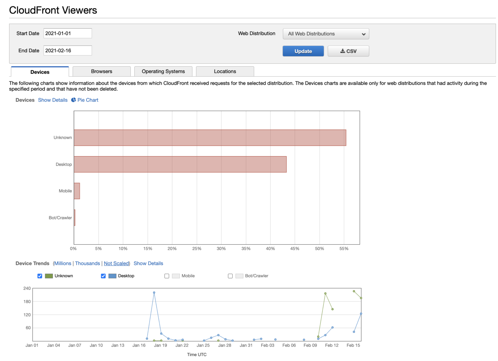
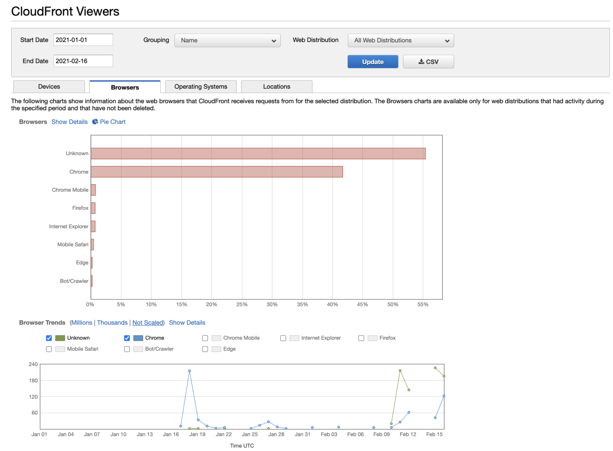
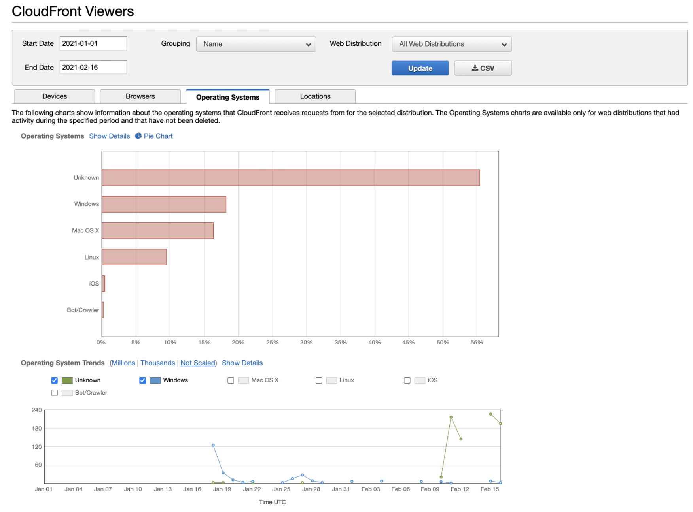
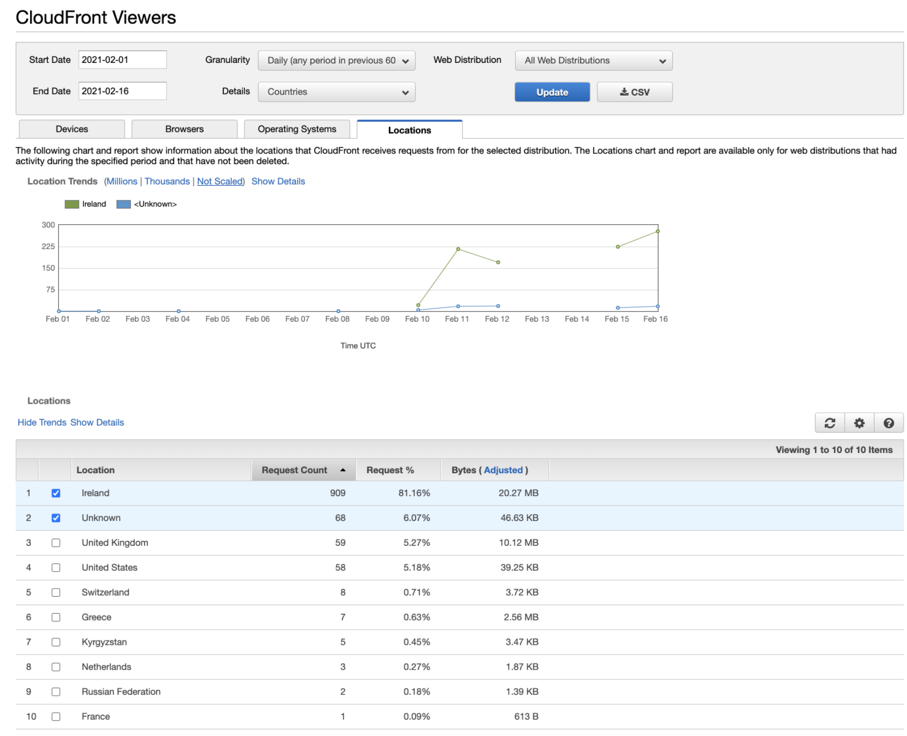

# Serverless URL Shortener

A Serverless URL Shortener service which allows you to deploy a URL Shortener in AWS using Serverless Framework

For the following example domain of `mycomp.click` to genenerate short urls i.e. `https://mycomp.click/tpXckS`

Supports click analytics visualisations and downloadable CSVs

# Technology Stack

- Cloudfront
- DynamoDB
- Lambda
- Route53
- Cloudformation
- Serverless Framework
- Typescript
- NodeJS

# Architecture


# Deployment

There are two options for deployment:

Prerequisites

- An ACM SSL Ceritificate in us-east-1 for `mycomp.click` - the ARN for the cerificate should be set as the `${acmcertarn}` variable

_If you require a DNS record to be create for your Cloudfront Distribution_

- A Route53 Hosted Zone ID set as the `${r53hostedzoneid}` variable. e.g. `Z2FDTNDATAQYW2`

# Without Route53 Record

`npm install`

`serverless deploy --stage=${stage} --region=${region} --acmcertarn ${acmcertarn} --domainname ${domainname} --creatednsrecord "false"`

The CloudFormation Stack outputs the CloudFront domain - direct your short Domain DNS record at this domain name

# With Route53 Record

`npm install`

`serverless deploy --stage=${stage} --region=${region} --acmcertarn ${acmcertarn} --domainname ${domainname} --r53hostedzoneid ${r53hostedzoneid} --creatednsrecord "true"`

# Usage

When the stack is deployed you will be provided an API key available in the API Gateway console called `key-${stage}`

Example CURL Request:

```javascript
curl --location --request POST 'https://mycomp.click/api/shorten' \
--header 'x-api-key: ${apikey}' \
--header 'Content-Type: text/plain' \
--data-raw '{
  "longurl": "https://www.google.co.uk/search?q=serverless+computing"
}'
```

Response:

```javascript
{
    "longurl": "https://www.google.co.uk/search?q=serverless+computing",
    "id": "WKp5Ow",
    "created": 1613425012,
    "expire": 1621114612,
    "shorturl": "https://mlabs.click/WKp5Ow"
}
```

_The response includes the following:_

`longurl` : the long url provided

`id` : the generated short unique id for your short url

`created` : epoch timestamp of creation date

`expire` : the expiry of this url (short url will become unavailable after this date / time)

`shorturl` : the short url generated

_Note:_ The default url expiry is set to now + 3 months. To override the expiry for the url - include this into the request as an epoch timestamp.

Example CURL Request with custom expiry:

```javascript
curl --location --request POST 'https://mycomp.click/api/shorten' \
--header 'x-api-key: ${apikey}' \
--header 'Content-Type: text/plain' \
--data-raw '{
  "longurl": "https://www.google.co.uk/search?q=serverless+computing",
  "expire": 1621114612
}'
```

This record will expire on Saturday, 15 May 2021 21:36:52

_Note:_ Short urls will be cached by Cloudfront for 1 day which means your lambda function invoke / dynamodb get will be cached for a day.

# Analytics

To view analytics for the usage of your short urls - The Cloudfront console offers a view of:

- Top URLs (Popular objects)
- Devices
- Browsers
- Operating Systems
- Locations

e.g.

_Devices_


_Browsers_


_Operating Systems_


_Locations_

